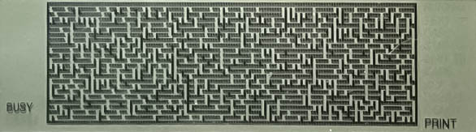

# g850_maze : "Maze" for Sharp PC-G850/V/VS (ポケコン)
"Maze" Problem Implementations in C and Z80 Assembler for Sharp PC-G850/V/VS Pocket Computers #ポケコン

Programmed by : 
	**HWR0** (@r0_hw)  
	*evilhardware(аt)mail.ru*

maze_std.c : <a href="https://github.com/hwreverse/g850_maze/blob/main/maze_std.c">view</a>   
-------------
	Slow double precision floating point random numbers
	Straightforward C code implementation with graphics and math library
	Is linked by z88dk with generic Z80 math library
	Speed = 4.77sec approximately
	
maze_fastc1.c : <a href="https://github.com/hwreverse/g850_maze/blob/main/maze_fastc1.c">view</a>
---------------
	Fast Linear Congruential Method Integer PRNG coded in inline z80 assembler
	Straightforward C code implementation with graphics library (no math library)
	Compiled by z88dk
	Speed = 1.1sec approximately

maze_fastc2.c : <a href="https://github.com/hwreverse/g850_maze/blob/main/maze_fastc2.c">view</a>
---------------

	Fast Linear Congruential Method Integer PRNG - modification proposed by @fujitanozomu
	Straightforward C Code implementation with graphics library (no math library)
	Compiled by z88dk
	Speed = *to be tested (should be <1.1sec!)

maze_asm.asm : <a href="https://github.com/hwreverse/g850_maze/blob/main/maze_asm.asm">view</a>
--------------
	Straightforward exclusive Assembler implementation
	GFX routines partially implemented from libg800
	Fast Linear Congruential Method Integer PRNG 
	Image generation in memory, then copy to VRAM with single update to screen 
	Speed = 0.15-0.25s (!) 

maze_fasm.asm : <a href="https://github.com/hwreverse/g850_maze/blob/main/maze_fasm.asm">view</a> 
--------------
	**Fastest implementation up to date**
	
  	Straightforward exclusive Assembler implementation
  	GFX routines partially implemented from libg800
	Fast Linear Congruential Method Integer PRNG - modification proposed by @fujitanozomu
  	Optimised jumps, Kept absolute jumps because of speed
	Sacrificed memory over speed by copying the point(X,Y) routine over each 'call vaddress'
	Image generation in memory, then copy to VRAM with single update to screen
	Speed < 0.15s (screen refresh is slow, cannot be measured visually any longer)
  
  
  
## TODO: 	
	Implement precise time measurement on PC-G850/V/VS by flipping PIO pin
	before and after "maze" to measure the delay between with a Logic Analyzer or an Arduino!
		
    
    
THANKS TO:
----------

*@hd61yukimizake*, for providing the mathematical "maze problem" idea on Twitter, and the asm sourcecode for the PB-1000 
*@fujitanozomu* for his PRNG variant  
*The original author of the libg800 library*  

Provided as is, 
by **HWR0 (@r0_hw)**  

<a href="https://raw.githubusercontent.com/hwreverse/g850_maze/main/img/hwr0pokekon.jpg"><b>
P.S.: Here , a part of my pocket computer collection!

  </b></a>
